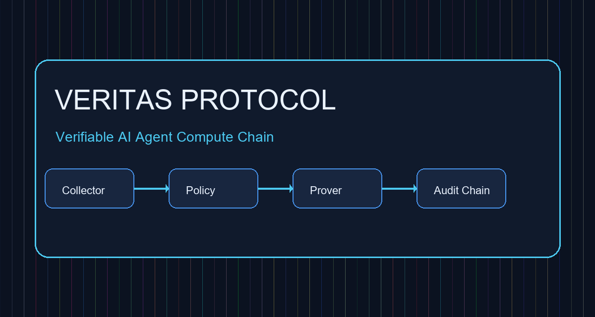
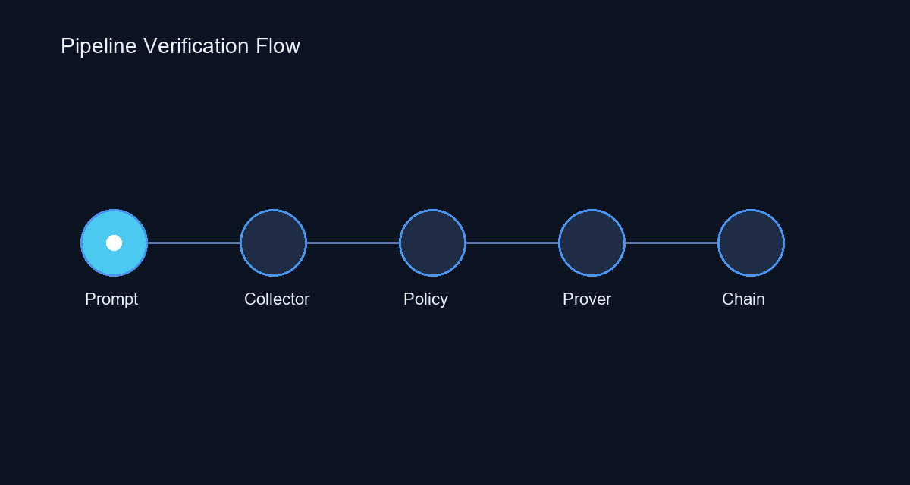
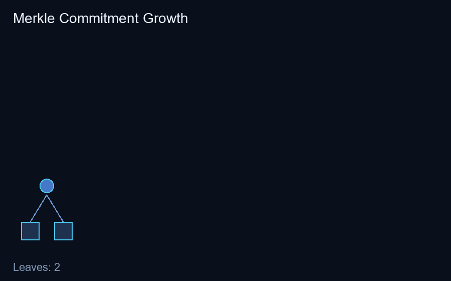
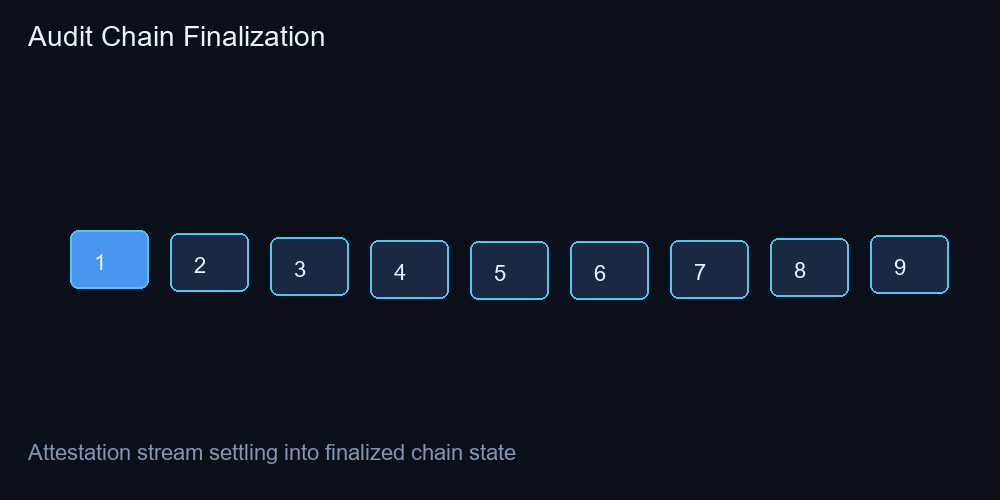

# Veritas Protocol

A self-sovereign, verifiable compute audit chain for agentic AI code generation.

## Blueprint Alignment
This repository implements the **Iteration 0 (Months 1-3) Proving Core** from `Blueprint.pdf` (dated **May 1, 2026**), including:
- `veritas-prove` CLI that takes a trace + policy and emits a proof artifact.
- Initial PDL parser/compiler stage (PDL -> deterministic constraints + policy root).
- End-to-end prove-verify-anchor loop with a 3-node mock audit chain.
- Tests for the Iteration 0 pass/fail scenario (3 file writes + 2 external process executions, under 120s).

It now also includes an **Iteration 1 collector prototype**:
- `veritas-collectord` sidecar-style collector CLI.
- deterministic canonical event capture for required syscall classes.
- intent-based write deduplication (`write(fd, x..z)` collapsed to final intent).
- streaming append-only MMR API: `append`, `get_proof`, `finalize`.
- CVT suite mapped to `FR-COLL-2/3/4/6`.

It now includes a substantial **Iteration 2 prover-network simulation**:
- distributed proof-race mempool simulation (`FR-PROV-1`).
- recursive proof aggregation abstraction (`FR-PROV-2`).
- cut-and-choose slashing simulation (`FR-PROV-3`).

It now includes **Policy module expansion**:
- multi-policy composition (org + repo + intent) (`FR-POL-2`).
- dry-run policy evaluation reports against recorded traces (`FR-POL-3`).

## Architecture
- `src/veritas/core`: trace loading, commitment roots, policy parsing, proving logic.
- `src/veritas/mock_chain`: verifier/attestation simulation.
- `src/veritas/cli`: CLI entry points.

## Visual Showcase


### Animated System Views




## Quickstart
```bash
python -m pip install -e .
veritas-prove --trace examples/session_trace.json --policy examples/policy_allow_all.pdl --out proof.json --anchor
veritas-collectord --trace examples/session_trace_iteration1.json --out collector-session.json
veritas-policy-dryrun --policy examples/policy_allow_all.pdl --policy examples/policy_deny_execve.pdl --trace examples/session_trace.json --out policy-dryrun-report.json
veritas-provernet-sim --trace-root trace-root-1 --policy-root policy-root-1 --trace-size 1400
```

## Test
```bash
python -m unittest discover -s tests -v
```

## Requirement Traceability
- `FR-POL-1`: PDL parsing + deterministic compile root in `src/veritas/core/pdl.py`.
- `FR-POL-2/3`: policy composition and dry-run reporting in `src/veritas/core/policy_engine.py`.
- `FR-COLL-4` (prototype abstraction): append-only deterministic event commitments in `src/veritas/core/trace.py`.
- `FR-COLL-2/3/4/6` (Iteration-1 collector prototype): `src/veritas/collector/*` and `tests/test_collector_cvt.py`.
- `FR-PROV-1/2/3`: simulated prover network in `src/veritas/prover_network/network.py`.
- `FR-CHAIN-1/2` (prototype abstraction): `verify_and_attest` flow in `src/veritas/mock_chain/chain.py`.
- `Iteration 0 Exit Gate`: scenario test in `tests/test_prover.py`.

## Roadmap
- Iteration 1: real collector sidecar + eBPF capture + MMR streaming.
- Iteration 2: distributed prover race and recursive aggregation.
- Iteration 3: CI action and compliance dashboard.
- Iteration 4: regulatory hardening and mainnet readiness.

## License
MIT. See [LICENSE](LICENSE).
